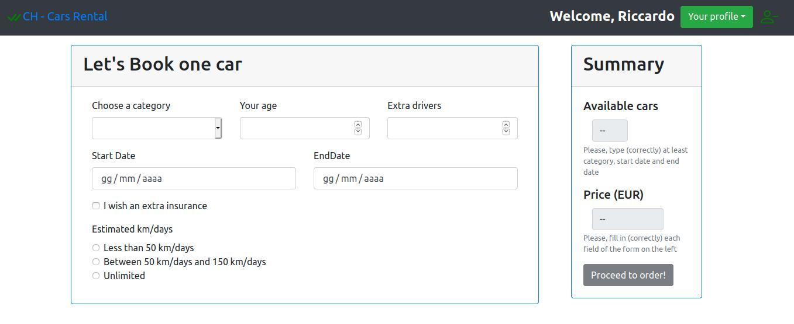

# Car Rental - React and Node Application

## Disclaimer

This application is not intended for production use, and its primary purpose is to serve as a learning resource for understanding the fundamentals of building a web application with React and Node.js.

## Project Description

The "Car Rental" application is designed to manage a vehicle rental company. Users can browse the list of vehicles, filter them by category and/or brand. Authenticated users have access to an interactive configurator for rental requests, with price calculation and the number of available cars. The application is implemented in React for the frontend and Node+Express for the backend, with an SQLite database.

## Main Components

- **Catalogue:** List of vehicles with multiple filters.
- **Login:** Access page to reserved sections.
- **Configurator:** Interactive configurator for rental requests.
- **UserRentals:** Display and cancellation of past, current, and future rentals.
- **TitleBar:** Title bar with navigation buttons and logout.

## Main Features

- **Catalogue:** View and filter the list of vehicles in real-time.
- **Login:** Authentication with user information return and JWT cookie.
- **Configurator:** Set rental parameters, calculate price, and check car availability.
- **UserRentals:** Consultation and cancellation of past, current, and future rentals.
- **API:** REST services for login, logout, vehicles, prices, reservations, payments, and rentals.

## Project Structure

- **client:** React frontend.
- **server:** Node+Express backend.

## Startup Instructions

1. Clone the repository:
   ```bash
   git clone https://github.com/CaptainHighlander/car-rentall-sample.git
2. Start the server:
	```bash
	cd server
	nodemon server.js			
3. Start the client:
	```bash
	cd client
	npm start
4. Open http://localhost:3000 in your browser.

# REST API Documentation

## Authentication

### POST `/api/login`
- **Request Body Content:** Consists of the email (username) and password.
- **Response Body Content:** If authentication is successful, it consists of an object containing user information (email, name, surname, number of rentals) and the associated cookie.

### POST `/api/logout`

### GET `/api/csrf-token`
- **Response Body Content:** A cookie useful against CSRF vulnerabilities.

### GET `/api/users`
- **Response Body Content:** An object containing information about the currently logged-in user.

## Vehicle Information

### GET `/api/vehicles`
- **Request Query Parameters:** None or category, startDate, and endDate.
- **Response Body Content:** If no query parameters are specified, it contains an object with a list of all available vehicles. Otherwise, it contains an object with the number of cars in the 'category' available between 'startDate' and 'endDate'.

## Rental Pricing

### GET `/api/prices`
- **Request Query Parameters:** category, age, startDate, endDate, extraDrivers, extraInsurance, estimatedKm, numberOfRentals.
- **Response Body Content:** Object containing the rental price calculated from the request query parameters.

## Reservation

### POST `/api/reservations`
- **Request Body Content:** Rental data (category, driver's age, start date, end date, extra drivers, extra insurance, number of rentals, price).
- **Response Body Content:** Empty object if the reservation can be confirmed, i.e., if all rental data (including recalculated price) is valid.

## Payment

### POST `/api/payments`
- **Request Body Content:** User name, credit card code, CVV, and amount to be paid.
- **Response Body Content:** Object containing a message indicating that the transaction was successful (always true unless the body content is invalid).

## Rental Management

### POST `/api/rentals`
- **Request Body Content:** Data related to the rental made.
- **Response Body Content:** Empty if no issues are encountered during rental creation.

### GET `/api/rentals`
- **Request Query Parameters:** period. Valid values for the parameter are: "past" (past rentals), "current" (currently active rentals), "future" (future rentals). The 'period' parameter indicates which rentals the user wants to obtain.
- **Response Body Content:** Object containing the list of rentals that the user has made in the specified period.

### DELETE `/api/rentals/:id`
- **Request Parameters:** ID of the rental to be removed (removal only valid for future rentals).

**Note:** The only APIs that do not require authentication are: `/api/login`, `/api/prices`, `/api/vehicles`.

# Database Documentation

## USERS Table
- Contains information about registered users.
  - Fields: email (ID), name, surname, password hash, number of rentals.

## VEHICLES Table
- Contains the list of available vehicles.
  - Fields: ID, category, brand, model.

## RENTALS Table
- Contains the list of all rentals made.
  - Fields: ID, IDUser (user's email who made the rental), category of the rented car, start date of the rental, end date of the rental, and additional information (driver's age, number of additional drivers, whether extra insurance was requested, and the estimated daily number of kilometers to travel).

## Test Users (email, password)
- ricky@poli.it, riccardo96 (frequent customer, 3 rentals)
- pippo@voda.it, Goofy1960 (2 rentals)
- mario@rtsm.com, supreme19
- yuurei@voda.it, yuurei_bana97 (1 rental)
- fabian@rtsm.com, razor
- miss_hg@voda.it, missHg95

## Screenshot

